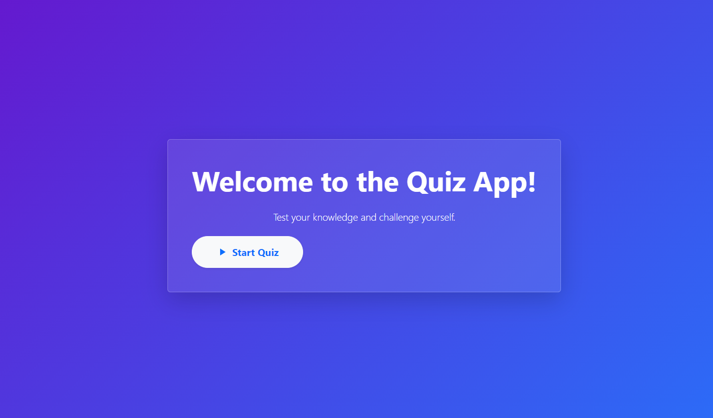
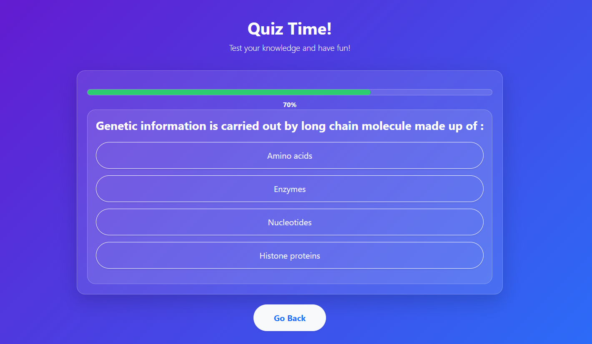
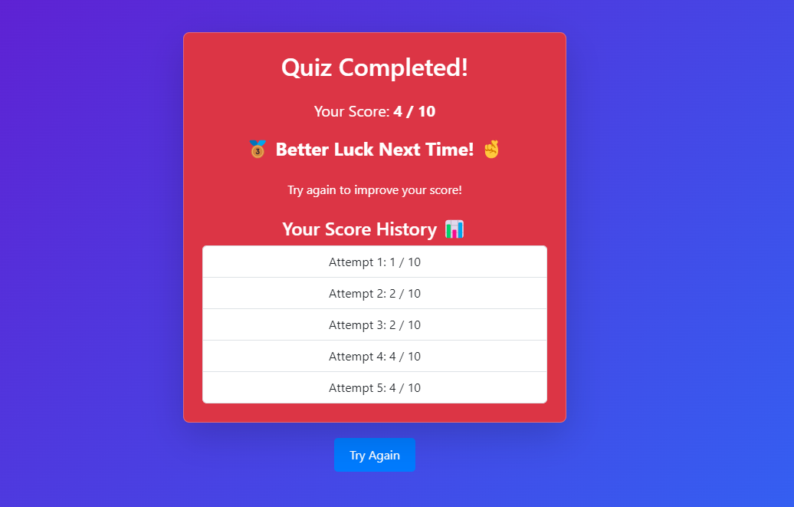

# Quiz App

A web-based quiz application with gamification features.

## Features
- Fetch quiz data from an API.
- Display questions with multiple-choice answers.
- Show a summary of results upon quiz completion.

## Setup
1. Clone the repository.
2. Run `npm install` to install dependencies.
3. Run `npm start` to start the development server.

## Screenshots

## Video Walkthrough
[Link to video walkthrough](#)